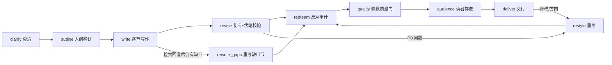

# Stylotrace 工作流与 Agent 合作体系（架构总览）

> 版本：v0.41 · 2026-08-11
> 读法：先看状态机，再看协作协议，最后看"LLM 优先 / 代码安全网"边界——这条边界是
> 本项目"不硬编码、不打架、能力不缩水"的全部秘密。新增任何模块前先对照本文。

---

## 1. 三层架构

```
┌────────────────────────── 宿主层 ──────────────────────────┐
│ Codex / Claude Code / OpenCode / Web（server.mjs 包装同一核心）│
│ 只做三件事：转发用户消息、查看数据待办、把检索结果回灌         │
└──────────────────────────┬─────────────────────────────────┘
                           │ MCP（被动）/ HTTP（REST）
┌──────────────────────────▼─────────────────────────────────┐
│ Stylotrace 核心（agent/src）                                    │
│ 导演状态机 director.js 主导全程；各 agent 模块按阶段被调用     │
│ clarify / outline / write / revise / redteam / quality /      │
│ audience / deliver / restyle + 供给与评估模块（rag、style、   │
│ consistency、reader-gallery、roundtrip、character、academic…）│
└──────────────────────────┬─────────────────────────────────┘
                           │ 只读写自己的工作区
┌──────────────────────────▼─────────────────────────────────┐
│ 数据层：<工作区>/.stylotrace/                                   │
│ protocol/state.json（状态机唯一事实） · context.jsonl         │
│ requests.jsonl（对外数据待办） · vault/（风格/向量/知识/大纲/  │
│ curve/consistency/… 全部沉淀物）                              │
└─────────────────────────────────────────────────────────────┘
```

不变式：**状态机的唯一事实是 `protocol/state.json`**；任何会写 state 的子函数之后，
调用方必须重读再写（代码里反复出现 `({ state, d } = load())` 就是这个纪律）。

## 2. 导演状态机（一条主线，各阶段可回环）



| 阶段 | 触发 | 主决策（LLM） | 安全网（确定性） | 用户看到 |
| --- | --- | --- | --- | --- |
| clarify | 用户消息 | 问什么、怎么问（questioner） | 低意愿计数、未答维度保待办、素材门槛、回答 L0–L5 自评 | 一次一问 + 建议 + 选项 + 确认清单 + 实时大纲 |
| outline | 核心字段齐 | 从对话总结完整大纲（呈现物，非约束） | 完成度结算（percent/complete）只报告不替代 | 大纲卡片 + 确认/修改 |
| write | 大纲确认 | 每节正文（注入风格/素材/角色/学术/个人 skill） | 字数 ≥85% 门槛 + 扩写两轮；黑名单/重复比喻脉搏；伏笔记账 | 每节进度 + 风格脉搏分 |
| revise | 初稿完成 | 全文复查（偏题/衔接/素材用足） | 伏笔回收校验（LLM 判定 + 关键词兜底） | （静默，P0 才回一句"正在修"） |
| redteam | 复阅后 | 按风格修订 | 黑名单/重复句式/统计指标审计，≤3 轮 | 审计进度 |
| quality | 红队过 | 风格保真评估、回译校验、事实核查 | 原创性/校对/事实分级（内置，不刷屏） | （无，只进交付警告） |
| audience | 质量门过 | 8 位读者感性反馈 + 交锋收敛 | 归档、蒸馏个人 skill、导出 docx | 读者群像 + 共识/争议 |
| deliver | 群像后 | 交付消息 | 全部警告汇总（字数/校对/事实/回译/伏笔） | 成稿 + 下一步建议 |

## 3. Agent 合作体系（谁主导、谁让位、谁供给）

### 3.1 生态位探测（Observer）

- `probeTask()` 用确定性词表快速判断任务是否落在写作生态位，返回 `entry`
  （academic / official / creative / style / outline / point-edit）与 `suggest`（agent / point-edit / none）。
- 纪律：**提议只一次、可拒绝**；被拒即完全退让。编程/翻译/总结/闲聊等负向词表命中 → 绝不越界触发。
- 主动，但把最终决定权留给宿主与用户（probe 是提议，不是抢话）。

### 3.2 MCP 被动协议

- Stylotrace 不监听对话、不自动运行；宿主不调用工具就不执行任何动作。
- 全部能力以工具暴露：`agent_step`（导演单步）/ `clarify_step` / `interview_step` /
  `outline` / `write` / `redteam` / `audience` / `rag_*` / `point_edit` / `consistency` /
  `curve` / `style_*` 等。宿主只转发用户消息并执行检索供给。

### 3.3 供给方协议（写论文/报告时的数据闭环）

```
Stylotrace 判定"需要资料" ──► 写 requests.jsonl（purpose: clarify-data/outline-gap/
                                    write-gap/fact-check/asset-search，去重、不阻塞）
        ▲                                        │
        └── rag ingest 回灌 ◄── 宿主/学术/数据分析 agent 查看 needs 并检索
```

- 回灌结果自动进素材与缓存；写作阶段仍缺 → 标注【素材不足】→ 交付前自动重写缺口节（≤2 轮）。
- 数据没回来照常推进，交付时提示缺口，绝不空转等数据。

### 3.4 主权与退让协议

1. **主权顺序：用户指令 > 宿主当前动作 > Stylotrace。** 宿主正在做事时绝不插入。
2. **写文件前重读校验**：改任何非 `.stylotrace/` 文件（如 point-edit 改用户 md）前必须确认原文还在原位置；被改过 → 中止退让。
3. **draft.md 外部修改检测**：写后 hash 变了 → 报错要求 `--force`，不静默覆盖。
4. **不碰别人的地盘**：只读写自己的工作区与用户明确指定的文件。
5. **宁可不动，不可覆盖**：检测到外部改动就让路、报告、等用户决定。

## 4. LLM 优先 / 代码安全网（防硬编码的边界）

判断标准一句话：**凡是"创造性决策"交给 LLM；凡是"可解释的校验/结算/格式"才用确定性代码；
确定性结果只做安全网与降级，绝不替代 LLM 的决策。** 规则 ≠ 硬编码：规则是"什么算齐、
什么算错"的可解释约束；硬编码是"替 LLM 决定怎么写、问什么"。

| 决策点 | 主决策 | 确定性（安全网） |
| --- | --- | --- |
| 问什么问题 | LLM（questioner，从用户原词生长） | 低意愿计数、素材门槛、未答维度待办、L0–L5 自评 |
| 大纲长什么样 | LLM（从对话总结的呈现物） | 完成度百分制结算（只报告，不生成） |
| 正文怎么写 | LLM（多路风格注入） | 字数门槛、黑名单/重复比喻、伏笔记账 |
| 伏笔是否回收 | LLM 判定 | 关键词二元组候选（安全网，宁多报不误报） |
| 节奏/情绪分数 | ——（本质是统计指标） | 确定性计算（这不是决策，是度量） |
| 意图理解 | LLM | 确定性 fallback 摘要 |
| 校对 | LLM 语病 | 错别字/叠字/标点确定性扫描 |
| 事实核查 | —— | 数字/年代/引文确定性分级（material/common/verify） |
| 生态位判断 | 宿主最终拍板 | 确定性词表快速过滤 |
| 风格学习 | LLM 整体提炼 + 确定性逐轮信号 | 两路互补，同写一个档案 |

### 三层规则层级（为什么不冲突）

- **skill 硬门槛**（给宿主 agent 的纪律）：什么算"需求齐了"（主题/字数/立场/素材/立意/论点）。
- **prompt 软引导**（给 questioner LLM 的追问风格）：只问高价值全局问题、从原词生长、
  不机械追问、素材不足就说明"够起笔"。
- **代码安全网**（最后兜底）：缺必填就拉回缺口、未答维度不默认、低意愿连续两次才放行。

三者对象不同、目标一致：**不机械追问、不默认跳过、不替用户拍板**。任何改动都不得
让其中一层替代另一层（例如禁止把"素材 ≥ N 条"写死进代码替代 LLM 判断）。

## 5. 防冲突清单（本轮核查结论）

- **已修（v0.41 遗留 bug）**：导演 revise 阶段先跑 `checkConsistency`（会写 state），
  随后用内存旧 state 写盘会冲掉伏笔/一致性结果 → 已改为校验后 `load()` 重读。
- **已确认无冲突**：
  - style-pulse 单向依赖 revise 的情绪曲线（revise 不反向依赖，无环）；
  - consistency（伏笔回收）与 bible（跨篇一致文档）互补，前者管"本篇内伏笔"、后者管"跨篇设定"；
  - 隐式风格流水与 applyStyleSignals 是同一采集的两份产物（证据流水 + 档案），不双写冲突；
  - Web 新增 `/api/curve` `/api/consistency` 只读，不写 state；
  - 大纲仍是"呈现物"：风格、素材、知识库、对话意图是写作真源，任何新注入不得把大纲升为约束。

## 6. 能力保障（每个环节不缩水）

| 你要的能力 | 实现位置 | 保障方式 |
| --- | --- | --- |
| 主导对话 | director 状态机 | 自动推进到交付，只在真决策点停下 |
| 实时可见 | 每阶段进度消息 + 玻璃面板 + Web 上下文 | state.summary/nextStep 每步写盘 |
| 风格持续学习 | style / style-vector / style-pulse / style-signals | 每轮采集 + 修改即教学 + 压缩不丢 |
| 多轮不重复、不死板 | questioner prompt + 蓝图 + 大纲缺口驱动 | LLM 决策 + 确定性安全网 |
| 跨章一致 | consistency / bible / character | 伏笔记账回收 + 设定文档 + 角色预演 |
| 数据闭环 | rag requests/ingest + rewrite_gaps | 去重排队、不阻塞、回灌即重写 |
| 反 AI 味 | redteam + roundtrip + originality | 黑名单/句式/重复比喻 + 回译校验 |
| 多模态 | ingest / dictate / export | docx/xlsx/图片/语音 → 素材；docx/PDF/SRT 导出 |
| 参赛可复现 | agent 13 套 + web 6 套 QA | 全链路 mock 断言，双端同源 |

## 7. 新增模块的入场检查（对后续所有改动生效）

1. 会写 state 吗？→ 调用方必须在调用后重读（或显式合并再写）。
2. 确定性逻辑会替代 LLM 决策吗？→ 不行；只能做校验/结算/降级。
3. 会碰工作区之外的文件吗？→ 写前重读校验，冲突即让位。
4. 有循环 import 吗？→ 不行；保持单向依赖。
5. 改了 agent/src 吗？→ 必须 `bash scripts/sync-skill-engine.sh` 同步引擎。
6. 改了两端吗？→ agent/web 版本号必须一致，双端 QA 都跑。
7. 有没有把"大纲/模板/清单"升级成写作约束？→ 大纲只是呈现物，素材/风格/知识/意图才是真源。
